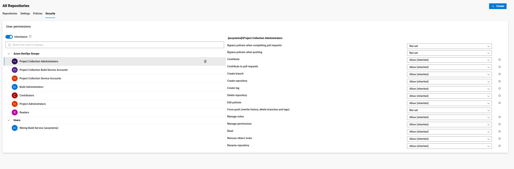
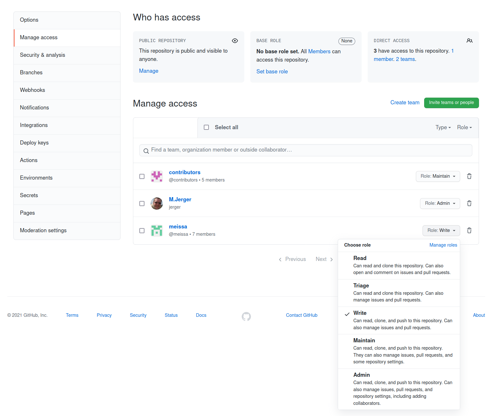

# Rechte Management

Rechte Management funktioniert in Git nicht auf Dabei-Baum Ebene sondern nur auf der Ebene des gesamten Repositories.

Git Repositories befinden sich nach einem clone komplett auf dem Entwickler-Rechner, ein feiner granulares RechteMgm macht hier kein Sinn mehr!

## Mögliche Lösung: Git mit Submodules

Um das Rechtemanagement abzubilden könnte wir mehrere verknüpfte Repositories (Git-Submodules) andenken: https://git-scm.com/book/en/v2/Git-Tools-Submodules

In unserem Bsp. sind das
* https://github.com/DomainDrivenArchitecture/svn-master
* https://github.com/DomainDrivenArchitecture/svn-sub1
* https://github.com/DomainDrivenArchitecture/svn-sub2

### UseCase1: Alle Repos clonen

* Clone und Update `git clone --recurse-submodules --remote-submodules`
* Nur Clone `git clone --recurse-submodules`

### UseCase2: Ein Mitarbeiter A hat nur ein Submodul im Zugriff ändert etwas und Admin B hat alles im Zugriff und aktualisert Master so, dass ein clone "latest" möglich ist.

* A pusht Änderungen in das Submodul
* B ruft im Master-Module `git submodule update` auf um alle Submodule zu aktualisieren

Erweiterungen für verschiedene Probleme:
* mit abschließendem Name, um nur ein bestimmtes Submodul zu aktualisieren
* `--recursive`, falls die Submodule eigene Submodule haben
* `--init`, falls es neue Submodule gibt

### UseCase3: Tag über alle Module im neuesten Stand

* Tagge alle Submodule `git submodule foreach git tag -m "tagName" tagName`
* Main-Modul `git tag -m "tagName" tagName`

## Möglichkeit: Rechte auf SVN-Plattform-Ebene

* Einschränkung von Push / Trigger v. CI
* Rechte auf Azure-DevOps:
  -> 
* Rechte auf GitHub 
  -> 

## Dokumentation

* Git-Submodule: 
   * https://git-scm.com/book/en/v2/Git-Tools-Submodules
   * https://www.w3docs.com/learn-git/git-submodule.html
* Git-Subtree: https://www.w3docs.com/learn-git/git-subtree.html 
