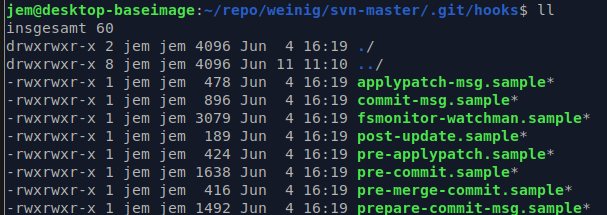

# Hook

Git kennt Hooks auf mehreren Ebenen:

## Hook auf git-client Ebene

https://githooks.com/
Git Hooks sind ausführbare Bash-Skripte in .git/hooks und werden bei verschiedenen Git Aktionen automatisch ausgeführt.

Bsp unter [HooksPrePush.sample](HooksPrePush.sample)

## Hook auf Platform Ebene

Plattformen schicken typischerweise Posts, die über verschiedene Events getriggert werden können (commit, push). Im Payload sind dann die entsprechenden Daten (z.B. Commitmessage, ...):
* Github: [https://docs.github.com/en/developers/webhooks-and-events/webhooks/webhook-events-and-payloads#commit_comment](https://docs.github.com/en/developers/webhooks-and-events/webhooks/webhook-events-and-payloads#commit_comment)
* Azure-DevOps: [https://docs.microsoft.com/en-us/azure/devops/service-hooks/services/webhooks?view=azure-devops](https://docs.microsoft.com/en-us/azure/devops/service-hooks/services/webhooks?view=azure-devops)
