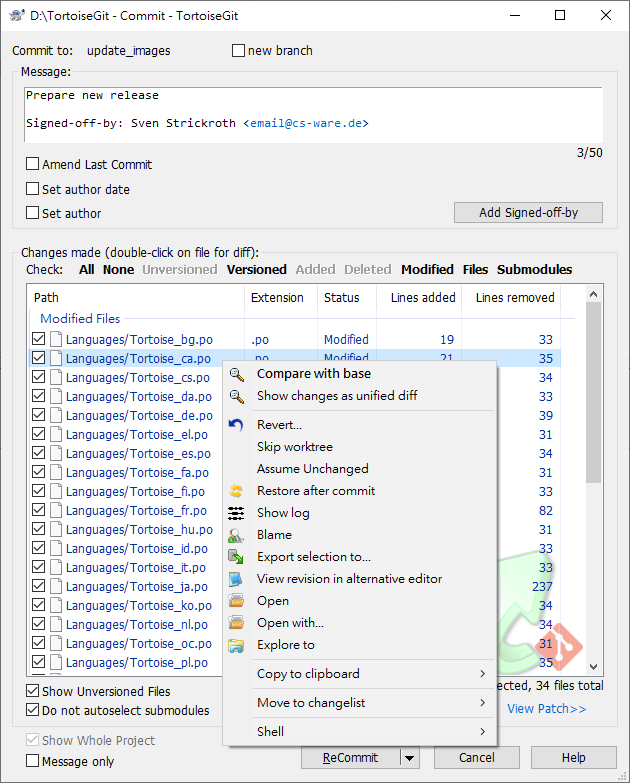
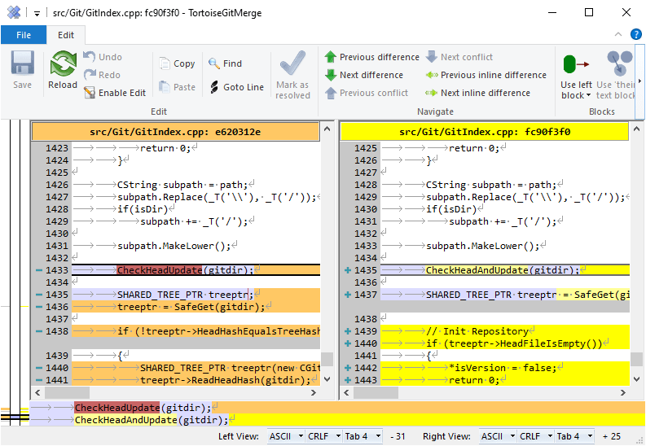

# Fragen svn-git

1. Distributed Version Control: [DistributedVersionControll.md](DistributedVersionControll.md)
2. Rechtemanagement: [Authorization.md](Authorization.md)
3. Migration von SVN nach Git: [MigrateFromSvn.md](MigrateFromSvn.md)
   1. Wie werden denn die externals konkret genutzt?
4. Mails versenden: [Hooks.md](Hooks.md)
5. Einbinden von Repositories / Externals: [ExternalAndDump.md](ExternalAndDump.md)
6. Management v. Secrets für Deployments / DB Migrationen o.ä.: [Secrets.md](Secrets.md)
7. Authentifizierung:
   1. git direkt: per http - Benutzername und Passwort möglich
   2. git direkt: per ssh - private / publick key möglich
   3. auf der Plattform: Benutzername / Passwort und mfa möglich
8. Backup: ein cron mit `git pull` reicht aus.
9. Artifacts: siehe Azure-DevOps Artifacts
10. Tortise-Git: https://tortoisegit.org/
    
    

    
11. Svn-Brige [GitSvnBridge.md](GitSvnBridge.md)
    1. Github: svn checkout https://github.com/DomainDrivenArchitecture/svn-master.git
